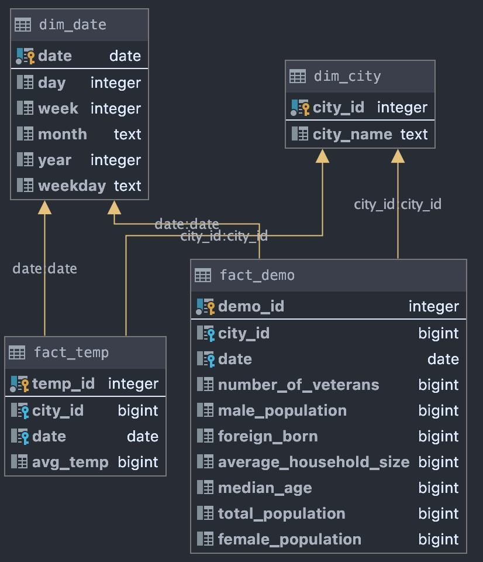

# Project 5 - Capstone

## Overview

The objective of this project was to create an ETL pipeline for global land temperatures and US demographics datasets to form an analytics database on US climate change as well as population analysis.

## Pipeline


## Database structure



## Data dictionary

### Input data (CSV and JSON files)

### Temperature data set

|Column|Description|Note|
--- | --- | ---
|dt|Date when temperature reading was taken||
|AverageTemperature| Average temperature recorded||
|AverageTemperatureUncertainty|_Irrelevant_|Removed during ETL process|
|City|City of the temperature reading|Removed during ETL process|
|Country|_Irrelevant_|Removed during ETL process|
|Latitude|_Irrelevant_|Removed during ETL process|
|Longitude|_Irrelevant_|Removed during ETL process|

### Demographic data set

|Column|Description|Note|
--- | --- | ---
|datasetid|_Irrelevant_|Removed during ETL process|
|datasetid|_Irrelevant_|Removed during ETL process|
|fields|Contains JSON structure of the actual data||
|record_timestamp|_Irrelevant_|Removed during ETL process|

### Output data (PostgreSQL)

***Database structure section***

## Data exploration

Data exploration was done with Jupyter notebooks located in `data_exploration` directory

## How to run

### Pre-requisites

- Docker
- Docker compose
- Python 3.8
- make

### Recipe

1. Clone the repository

   ```bash
    git clone https://github.com/jpuris/udacity-data-engineering-capstone.git
    cd udacity-data-engineering-capstone
   ```

2. Set up the virtual env

    ```bash
    make prep-venv
    # if you inded to controbute, set up dev env
    make prep-venv-dev
    ```

3. Download the source data

   ```bash
   make prep-source
   ```

   This will download the demographics data, but not the temperature data.

4. Download the temperature data yourself and move the file to `data/global_land_temperatures_by_city`.

    The file is available for download from [Kaggle](https://www.kaggle.com/berkeleyearth/climate-change-earth-surface-temperature-data). You need to retrieve the largest of the set called `GlobalLandTemperaturesByCity.csv`

5. Start database cluster on docker

    ```bash
    make
    ```

    This will start docker-compose script and after start tailing container logs.

6. Run ETL job

   ```bash
   venv/bin/python3 etl/run.py
   ```

## Scalability and scheduling

***Scenarios***

```txt
The data was increased by 100x.
```

To comply with this scenario, one would need to extend this project to include Apache Spark technology. Spark scales near linearly and would be excellent fit.

```txt
The pipelines would be run on a daily basis by 7 am every day.
```

Apache Airflow would enable automation. The pipeline can be easily split up and turned into a DAG (Directed Acyclic Graph).

```txt
The database needed to be accessed by 100+ people.
```

The scaling has to happen on the access layer of the dataset or the database (depending on if the target audiance is looking for a data warehouse or data lake).

## The future

This repository was intended for demonstration of some of the aquired skills througout the Udacity course of Data engineering nano-degree. The development of this repository has stoped.
